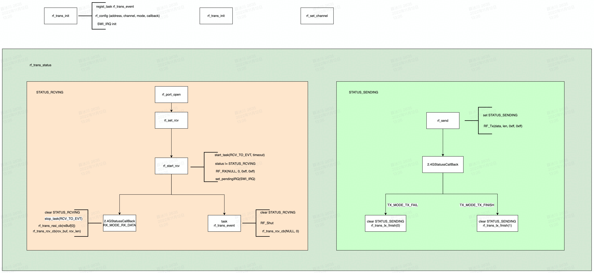
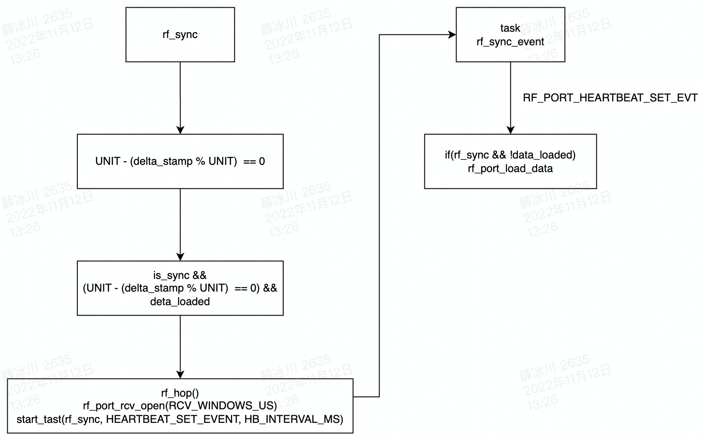

2.4g 工作流程整理

rf_dev
````
初始化 pre_init
  rf_trans_init
  rf_port_init
  rf_sync_init

事件处理 rf_device_event
  SYS_EVENT_MSG -> rf_device_msg
    KEY_MESSAGE -> set_event(RF_SEND_EVENT)
    RF_PAIR_MESSAGE ->set_event(PAIR_EVENT)
  PAIR_EVENT -> rf_pair_start
  RF_SEND_EVENT
    rf_tx_deal
      rf_port_load_data(RF_TYPE_CMD_KEY, ...)
    If(ret!= 0) start(RF_SEND_EVENT)
````

rf_trans
    

rf_port
````
rf_port_init
rf_port_rcv_cb //接收回调，接收成功、失败处理
rf_port_rcv_open //准备接数据，设置接收buf，并开始接收
rf_port_load_data //拷贝待发送数据，通过rcv的回调发送
rf_port_is_data_loaded //有待发送数据
````

rf_hop
````
rf_hop_start // is_hopping -> true, 更新last_stamp
rf_hop_end //修改rf通道map[0], channel_idx = 0, is_hopping  -> false
rf_hop // 计算并更新rf通道
````

rf_sync
````
rf_sync_init
rf_sync  //rf_hop, open_port, start task
rf_is_sync  //start -> true, end -> false
rf_sync_start  //sync->true, rf_sync_start_stamp, rf_hop_start
rf_sync_end  //sync->false, rf_hop_end
````


````
rf_sync ---- sync(!sync && upper_deivation != 0 && data_need_send_back)
rf_hop ---- hop(is_hopping == true)
  rf_set_channel ---- trans
rf_port_rcv_open ---- port 
  rf_set_rcv ---- trans
  rf_start_rcv ---- trans
    tmos_start_task ---- trans //RF_TRANS_RCV_TO_EVT
      ~~rf_trans_event //接收超时
        RF_Shut ---- SDK
        rf_port_rcv_cb ----port (len == 0)
          rf_sync_end ---- sync //is_sync -> flase
            rf_hod_end
              rf_set_channel
    RF_Rx ---- SDK //打开rf接收
    PFIC_SetPendingIRQ(SWI_IRQ) ---- SDK
tmos_start_task ---- sync //RF_PORT_HEARTBEAT_SET_EVT
  ~~rf_sync_event //无负载数据发送 (sync && no_data_need_send_back)
    rf_port_load_data //准备待发回数据 RF_TYPE_CMD_HB

rf_port_load_data //准备待发回数据
is_data_loaded -> true //data_need_send_back
  触发sync，开启rx等待发送

2.4G_statusCallBack //2.4G回调处理数据收发
TX_MODE_TX_FAIL ---- rf_trans_tx_finish(0)
TX_MODE_TX_FINISH ---- rf_trans_tx_finish(1)
RX_MODE_EX_DATA
  tmos_stop_task //RF_TRANS_RCV_TO_EVT
  rf_port_rcv_cb(rcv_buf, rcv_len) ---- port  (len != 0)
    rf_sync_start ---- sync //is_sync -> true
      rf_hop_start ---- hop
        is_hopping = true
    ==rf_req_pair_cb //
      rf_pair_deal
        rf_port_load_data //配对 RF_TYPE_CMD_PAIR
        tmos_set_event //发送配对完成事件 RF_PAIR_END_EVT
          ~~RF_Pair_ProcessEven
            rf_pair_end
              rf_set_addr
              tmos_stop_task //结束配对超时RF_PAIR_TIMEOUT_EVT
              tmos_stop_task //结束配对 RF_PAIR_EVT
    ==rf_req_key_cb //
      rf_key_deal
        set_led
    rf_send ---- port
      RF_Tx ---- SDK

RF_device_TMOSMsg
tmos_set_event //PAIR_EVENT、RF_SEND_EVENT
  ~~rf_device_event
    PAIR_EVENT
      rf_pair_start
        rf_set_addr //设置默认地址 DEFAULT_MAC
          tmos_start_task //启动配对超时
          tmos_start_task //启动配对
            ~~RF_Pair_ProcessEvent
              RF_PAIR_TIMEOUT_EVT
                rf_set_addr //配对超时，恢复地址
              RF_PAIR_EVT
                rf_port_load_data //准备待发送配对地址 RF_TYPE_CMD_PAIR
                tmos_start_task //发送超时重试 RF_PAIR_EVT
    RF_SEND_EVENT
      rf_tx_deal
        rf_port_load_data //准备待发回数据 RF_TYPE_CMD_KEY
      tmos_start_task //发送超时重试 RF_SEND_EVENT
````


