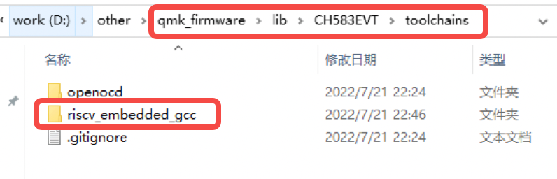
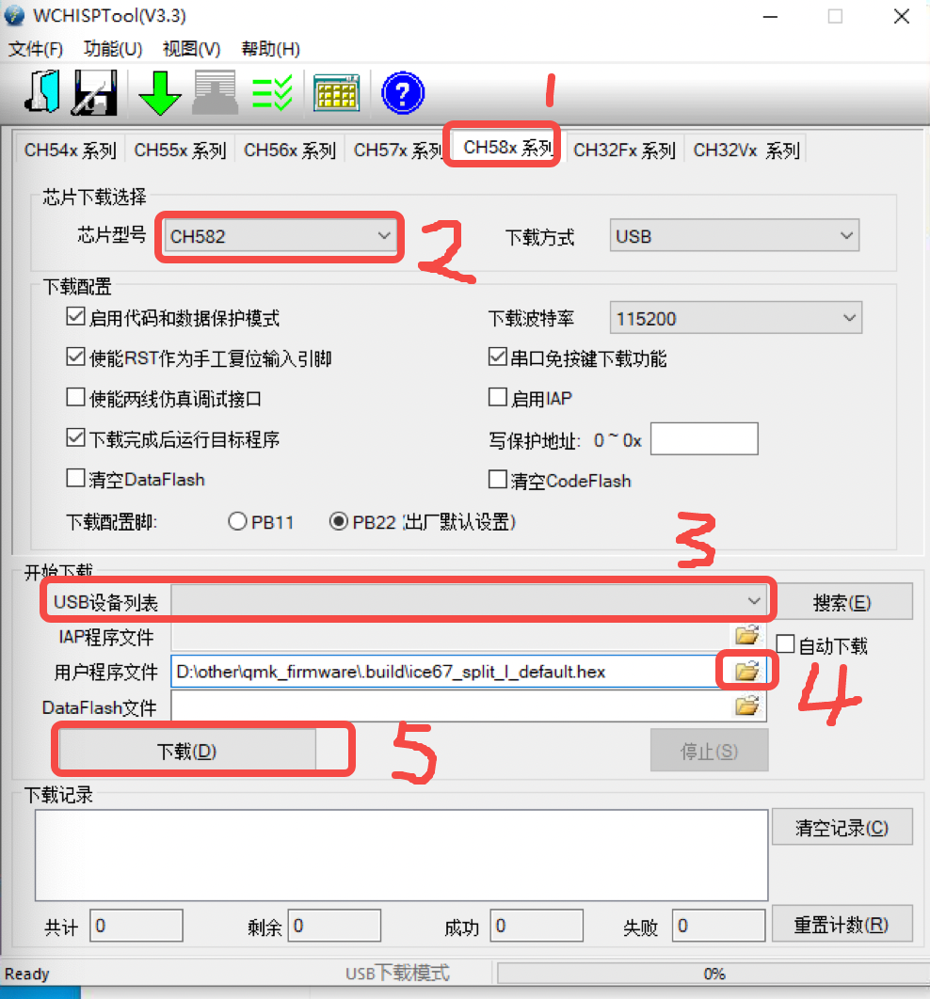

# ice_kbd开发手册
1. 前提条件
   1. 硬件：
      1. ice键盘或开发板
      2. 调试器（调试用，如果只烧录不需要）。淘宝搜“wch link”，10多块钱包邮。随便贴个链接供参考：[wch-link](https://item.taobao.com/item.htm?spm=a230r.1.14.11.79ec63dbcIxyB3&id=645437885121&ns=1&abbucket=6#detail)
   2. 代码权限：仓库目前在gitlab，最多只能加5个人，需要的联系我。后期如果参与人数多会迁移仓库
        ````
        https://gitee.com/icelittle/qmk_firmware
        https://gitee.com/icelittle/CH583EVT
        ````
   3. 软件
      1. 安装qmk工具：参考[QMK Firmware Docs](https://docs.qmk.fm/#/newbs_getting_started) 第2步
      2. [下载ide或工具链（windows、linux、mac）](http://www.mounriver.com/download)
      3. [WCH烧录工具](https://www.wch.cn/downloads/WCHISPTool_Setup_exe.html)

2. 下载代码
    ```console
    1.git clone https://gitee.com/icelittle/qmk_firmware.git
    2.cd qmk_firmware
    3.git submodule update --init --recursive
    4.git checkout wch_riscv
    ````
3. 准备编译环境
   1. 打开qmk，打开后是一个终端；
        ````
        cd qmk_firmware
        qmk setup
        ````
   2. 配置工具链
      1. 如果安装的是ide，去ide安装目录找到工具链
      2. 如果是工具链，解压
      3. 拷贝工具链到代码目录qmk_firmware/lib/CH583EVT/toolchains下，并重命名为riscv_embedded_gcc
        
4. 编译、烧录
   1. 打开qmk，编译固件
        ````
        cd qmk_firmware
        qmk compile -kb xxx -km default
        
        xxx：
            ice67_split_l：左手
            ice67_split_r：右手
            ice_num：小数字键
        ````
   2. 固件输出目录：
        ````
        qmk_firmware/.build/xxx.hex
        ````
   3. 软件烧录方法（目前只试过windows烧录工具）
      1. 打开WCH烧录工具
      2. 断开键盘usb，在pcb上找到boot、gnd，用镊子保持boot和gnd连接状态，键盘插usb上电
   4. 按下图步骤烧录
        
5. 调试（目前只试过windows下ide调试）
   1. ide调试
   2. openocd调试
